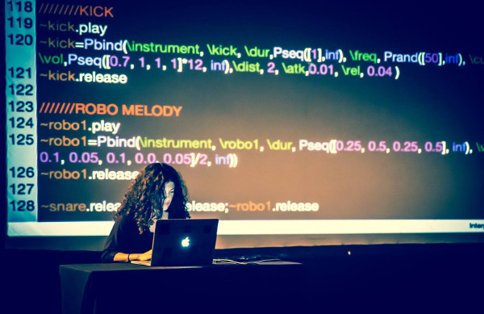

13-15th July 2015, University of Leeds, UK

With pleasure we announce the first International Conference on Live Coding, hosted by ICSRiM in the School of Music, University of Leeds, UK, and funded by the Arts and Humanities Research Council (AHRC) as part of the [Live Coding Research Network](http://livecodenetwork.org).

Live coding is where changes to a running computer program are made by editing the underlying source code, with live feedback through the programming environment and/or via the program's output. Since 2003, a growing movement has explored live coding to create live music and visuals, and in recent years latent activity in software engineering has seen a burst of new research directions and tools in live programming language design. Wider still, teachers, choreographers, psychologists, ethnographers, technologists and many other disciplines have seen the potential that live coding has in throwing new light on research questions, problems, and ways of working.

*Alexandra Cardenas, GEIGER Festival, Göteburg, Nov 2014. Photo: Ruud Gielens*

This conference follows a long line of international events on liveness in computer programming; the [Changing Grammars](http://swiki.hfbk-hamburg.de/MusicTechnology/609) live audio programming symposium in Hamburg 2004, the [LOSS Livecode](http://livecode.access-space.org/) festival in Sheffield 2007, the annual [Vivo](http://vivo.cenart.tv/) festivals in Mexico City from 2012, the [live.code.festival](http://imwi.hfm.eu/livecode/2013/) in Karlsruhe, the [LIVE](http://liveprogramming.github.io/2013/) workshop at ICSE on live programming, and Dagstuhl Seminar 13382 on [Collaboration and Learning through Live Coding](http://drops.dagstuhl.de/opus/volltexte/2014/4420/) in 2013, the [Breathing Code](http://breathing-code.de/) conference in Frankfurt 2015, as well as numerous workshops, concerts, algoraves and conference special sessions. It also follows a series of [Live Coding Research Network](http://livecodenetwork.org) symposia on diverse topics, and the activities of the [TOPLAP](http://toplap.org/) community since 2004.

*Sam Aaron, Live Notation Unit, Arnolfini, July 2012. Photo: pixelwitch*

We hope that this conference will act as a confluence for all this work, helping establish live coding as an interdisciplinary field, exploring liveness in symbolic abstractions, and understanding the perceptual, creative, productive, philosophical and cultural consequences.
